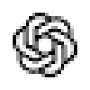

<div align="center">
  
  # Mirai - 免费 AI 路由器
  
  **永不停歇的编程体验。智能回退，自动路由到免费和廉价的 AI 模型。**
  
  **OpenClaw 的免费 AI 提供商。**
  
  <p align="center">
    
  </p>
  
  [](https://www.npmjs.com/package/mirai)
  [](https://www.npmjs.com/package/mirai)
  [](https://github.com/decolua/mirai/blob/main/LICENSE)
  
  [🚀 快速开始](#-quick-start) • [💡 特性](#-key-features) • [📖 设置](#-setup) • [🌐 网站](https://mirai.local)
</div>

---

## 🤔 为什么选择 Mirai？

**停止浪费金钱和触碰限制：**

- ❌ 订阅配额每月未使用即过期
- ❌ 编程中途遭遇速率限制
- ❌ 昂贵的 API（每个提供商 $20-50/月）
- ❌ 手动在提供商之间切换

**Mirai 解决方案：**

- ✅ **最大化订阅价值** - 追踪配额，在重置前用尽每一分
- ✅ **自动回退** - 订阅 廉价 → 免费，零停机时间
- ✅ **多账户** - 每个提供商的账户间轮询
- ✅ **通用性** - 适用于 Claude Code, Codex, Gemini CLI, Cursor, Cline, 任何 CLI 工具

---

## 🔄 工作原理

```
┌─────────────┐
│  Your CLI   │  (Claude Code, Codex, OpenClaw, Cursor, Cline, Antigravity...)
│   Tool      │
└──────┬──────┘
       │ http://localhost:1463/v1
       ↓
┌─────────────────────────────────────────────┐
│           Mirai (Smart Router)            │
│  • RTK Token Saver (节省 20-40% Token)      │
│  • 格式转换 (OpenAI ↔ Claude)               │
│  • 配额追踪 (Quota tracking)                │
│  • 自动刷新 OAuth Token                     │
└──────┬──────────────────────────────────────┘
       │
       ├─→ [Tier 1: 订阅] Claude Code, Codex, GitHub Copilot
       │   ↓ 配额用尽
       ├─→ [Tier 2: 低价] GLM ($0.6/1M), MiniMax ($0.2/1M)
       │   ↓ 触及预算上限
       └─→ [Tier 3: 免费] Kiro AI, OpenCode Free, Vertex AI ($300 credits)

结果：永不停歇的编程体验，最低成本 + 通过 RTK 节省 20-40% Token
```

---

## ⚡ 快速开始

**1. 全局安装：**

```bash
npm install -g mirai
mirai
```

🎉 仪表板将在 `http://localhost:1463` 打开

**2. 连接免费提供商（无需注册）：**

仪表板 → 提供商 → 连接 **Claude Code** 或 **Antigr** → OAuth 登录 → 完成！

**3. 在您的 CLI 工具中使用：**

```
Claude Code/Codex/Gemini CLI/OpenClaw/Cursor/Cline 设置:
  Endpoint: http://localhost:1463/v1
  API Key: [从仪表板复制]
  Model: if/kimi-k2-thinking
```

**就是这样！** 开始使用免费 AI 模型编程。

**替代方案：从源码运行（此仓库）：**

此仓库包是私有的（`mirai-app`），因此源码/Docker 执行是预期的本地开发路径。

```bash
cp .env.example .env
npm install
PORT=1463 NEXT_PUBLIC_BASE_URL=http://localhost:1463 npm run dev
```

生产模式：

```bash
npm run build
PORT=1463 HOSTNAME=0.0.0.0 NEXT_PUBLIC_BASE_URL=http://localhost:1463 npm run start
```

默认 URL：
- 仪表板：`http://localhost:1463/dashboard`
- OpenAI 兼容 API：`http://localhost:1463/v1`

### Changing the server port

Mirai by default runs on **`localhost:1463`**. You can change the port from the dashboard or the CLI, but only after Mirai **tests** that the port is free:

- **Dashboard:** open **Settings -> Server Port**, enter a port, click **Test**, then click **Apply & Restart** only when the test passes. Mirai saves the port, restarts, and serves on the new port. If the port is in use (or reserved), the change is refused.
- **CLI:** `mirai restart` (current port) or `mirai restart --port 8080` (specific port).

The port is persisted to `<dataDir>/config/port.json` and reused on the next start. Resolution order:

1. `PORT` environment variable
2. `<dataDir>/config/port.json`
3. Default `1463`

> Port `20129` is reserved for Mirai's internal use and cannot be used.

**Launcher shortcuts (source checkout):** the repo ships `mirai.cmd` (Windows) and `mirai` (bash):

```bash
.\mirai start      # Windows cmd
.\mirai restart
./mirai start      # bash / macOS / Linux
```

---

## 🎥 视频教程

<div align="center">
  
### 📺完整设置指南 - Mirai + Claude Code 免费
  
[](https://www.youtube.com/watch?v=raEyZPg5xE0)

**🎬 观看完整的分步教程：**
- ✅ Mirai 安装与设置
- ✅ 免费 Claude Sonnet 4.5 配置
- ✅ Claude Code 集成
- ✅ 实时编程演示

**⏱️ 时长：** 20 分钟 | **👥 作者** 开发者社区

[▶️ 在 YouTube 上观看](https://www.youtube.com/watch?v=o3qYCyjrFYg)

</div>

---

## 🛠️ 支持的 CLI 工具

Mirai 与所有主流 AI 编程工具无缝协作：

<div align="center">
  <table>
    <tr>
      <td align="center" width="120">
        <br/>
        <b>Claude-Code</b>
      </td>
      <td align="center" width="120">
        <br/>
        <b>OpenClaw</b>
      </td>
      <td align="center" width="120">
        <br/>
        <b>Codex</b>
      </td>
      <td align="center" width="120">
        <br/>
        <b>OpenCode</b>
      </td>
      <td align="center" width="120">
        <br/>
        <b>Cursor</b>
      </td>
      <td align="center" width="120">
        <br/>
        <b>Antigravity</b>
      </td>
    </tr>
    <tr>
      <td align="center" width="120">
        <br/>
        <b>Cline</b>
      </td>
      <td align="center" width="120">
        <br/>
        <b>Continue</b>
      </td>
      <td align="center" width="120">
        <br/>
        <b>Droid</b>
      </td>
      <td align="center" width="120">
        <br/>
        <b>Roo</b>
      </td>
      <td align="center" width="120">
        <br/>
        <b>Copilot</b>
      </td>
      <td align="center" width="120">
        <br/>
        <b>Kilo Code</b>
      </td>
    </tr>
  </table>
</div>

---

## 🌐 支持的提供商

### 🔐 OAuth 提供商

<div align="center">
  <table>
    <tr>
      <td align="center" width="120">
        <br/>
        <b>Claude-Code</b>
      </td>
      <td align="center" width="120">
        <br/>
        <b>Antigravity</b>
      </td>
      <td align="center" width="120">
        <br/>
        <b>Codex</b>
      </td>
      <td align="center" width="120">
        <br/>
        <b>GitHub</b>
      </td>
      <td align="center" width="120">
        <br/>
        <b>Cursor</b>
      </td>
    </tr>
  </table>
</div>

### 🆓 免费提供商

<div align="center">
  <table>
    <tr>
      <td align="center" width="150">
        <br/>
        <b>iFlow AI</b><br/>
        <sub>8+ 模型 无限制</sub>
      </td>
      <td align="center" width="150">
        <br/>
        <b>Qwen Code</b><br/>
        <sub>3+ 模型 • 无限制</sub>
      </td>
      <td align="center" width="150">
        <br/>
        <b>Gemini CLI</b><br/>
        <sub>180K/月 免费</sub>
      </td>
      <td align="center" width="150">
        <br/>
        <b>Kiro AI</b><br/>
        <sub>Claude • 无限制</sub>
      </td>
    </tr>
  </table>
</div>

### 🔑 API Key 提供商 (40+)

<div align="center">
  <table>
    <tr>
      <td align="center" width="100">
        <br/>
        <sub>OpenRouter</sub>
      </td>
      <td align="center" width="100">
        <br/>
        <sub>GLM</sub>
      </td>
      <td align="center" width="100">
        <br/>
        <sub>Kimi</sub>
      </td>
      <td align="center" width="100">
        <br/>
        <sub>MiniMax</sub>
      </td>
      <td align="center" width="100">
        <br/>
        <sub>OpenAI</sub>
      </td>
      <td align="center" width="100">
        <br/>
        <sub>Anthropic</sub>
      </td>
    </tr>
    <tr>
      <td align="center" width="100">
        <br/>
        <sub>Gemini</sub>
      </td>
      <td align="center" width="100">
        <br/>
        <sub>DeepSeek</sub>
      </td>
      <td align="center" width="100">
        <br/>
        <sub>Groq</sub>
      </td>
      <td align="center" width="100">
        <br/>
        <sub>xAI</sub>
      </td>
      <td align="center" width="100">
        <br/>
        <sub>Mistral</sub>
      </td>
      <td align="center" width="100">
        <br/>
        <sub>Perplexity</sub>
      </td>
    </tr>
    <tr>
      <td align="center" width="100">
        <br/>
        <sub>Together AI</sub>
      </td>
      <td align="center" width="100">
        <br/>
        <sub>Fireworks</sub>
      </td>
      <td align="center" width="100">
        <br/>
        <sub>Cerebras</sub>
      </td>
      <td align="center" width="100">
        <br/>
        <sub>Cohere</sub>
      </td>
      <td align="center" width="100">
        <br/>
        <sub>NVIDIA</sub>
      </td>
      <td align="center" width="100">
        <br/>
        <sub>SiliconFlow</sub>
      </td>
    </tr>
  </table>
  <p><i>...以及 20+ 更多提供商，包括 Nebius, Chutes, Hyperbolic 和自定义 OpenAI/Anthropic 兼容端点</i></p>
</div>

---

## 💡 核心特性

| 特性 | 功能 | 重要性 |
|---------|--------------|----------------|
|  **智能 3 层回退** | 自动路由：订阅 → 廉价 → 免费 | 永不停止编程，零停机时间 |
| 📊 **实时配额追踪** | 实时 Token 计数 + 重置倒计时 | 最大化订阅价值 |
| 🔄 **格式转换** | OpenAI ↔ Claude ↔ Gemini 无缝转换 | 适用于任何 CLI 工具 |
| 👥 **多账户支持** | 每个提供商多个账户 | 负载均衡 + 冗余 |
| 🔄 **自动 Token 刷新** | OAuth token 自动刷新 |需手动重新登录 |
| 🎨 **自定义组合** | 创建无限模型组合 | 根据需求定制回退策略 |
| 📝 **请求日志** | 调试模式包含完整请求/响应日志 | 轻松排查问题 |
| 💾 **云端同步** | 跨设备同步配置 | 到处都是相同的设置 |
| 📊 **使用分析** | 追踪 Token、成本、趋势 | 优化支出 |
| 🌐 **随处部署** | 本地主机、VPS、Docker、Cloudflare Workers | 灵活的部署选项 |

<details>
<summary><b>📖 特性详情</b></summary>

### 🎯 智能 3 层回退

创建具有自动回退功能的组合：

```
Combo: "my-coding-stack"
  1. cc/claude-opus-4-6        (your subscription)
  2. glm/glm-4.7               (cheap backup, $0.6/1M)
  3. if/kimi-k2-thinking       (free fallback)

→ Auto switches when quota runs out or errors occur
```

### 📊 实时配额追踪

- 每个提供商的 Token 消
- 重置倒计时（5 小时、每日、每周）
- 付费层的成本估算
- 月度支出报告

### 🔄 格式转换

格式间无缝转换：
- **OpenAI** ↔ **Claude** ↔ **Gemini** ↔ **OpenAI Responses**
- 您的 CLI 工具发送 OpenAI 格式 → Mirai 转换 → 提供商接收原生格式
- 适用于任何支持自定义 OpenAI 端点的工具

### 👥 多账户支持

- 每个提供商添加多个账户
- 自动轮询或基于优先级的
- 当一个账户达到配额时回退到下一个

### 🔄 自动 Token 刷新

- OAuth token 在过期前自动刷新
- 无需手动重新认证
- 所有提供商的无缝体验

### 🎨 自定义组合

- 创建无限模型组合
- 混合订阅、廉价和免费层
- 为您的组合命名以便访问
- 通过云端同步跨设备共享组合

### 📝 请求日志

- 启用调试模式以获取完整请求/响应日志
- 追踪 API 调用、标头和负载
- 排查集成
- 导出日志进行分析

### 💾 云端同步

- 跨设备同步提供商、组合和设置
- 自动后台同步
- 安全加密存储
- 从任何地方访问您的设置

#### 云端运行说明

- 在生产环境中优先使用服务器端云变量：
  - `BASE_URL`（同步调度器使用的内部回调 URL）
  - `CLOUD_URL`（云端同步端点基础 URL）
- `NEXT_PUBLIC_BASE_URL` 和 `NEXT_PUBLIC_CLOUD_URL` 仍支持兼容性/UI，但服务器运行时现在优先使用 `BASE_URL`/`C_URL`。
- 云端同步请求现在使用超时 + 快速失败行为，以避免在云端 DNS/网络不可用时 UI 挂起。

### 📊 使用分析

- 追踪每个提供商和模型的 Token 使用情况
- 成本估算和支出趋势
- 月度报告和洞察
- 优化您的 AI 支出

> **💡 重要 - 理解仪表板成本：**
> 
> 使用分析中显示的“成本”**仅用于追踪和比较目的**。
> Mirai 本身**从不向您收费**。您只需直接向提供商付款（如果使用付费服务）。
> 
> **示例：** 如果您的仪表板在使用 iFlow 模型时显示“$290 总成本”，这代表
> 您直接使用付费 API 时需要支付的金额。您的实际成本 = **$0**（iFlow 是免费无限制的）。
> 
> 将其视为“节省追踪器”，显示您通过使用免费模型或
> 通过 Mirai 路由节省了多少！

### 🌐 随处部署

- 💻 **本地主机** - 默认，离线工作
- ☁️ **VPS/云** 跨设备共享
- 🐳 **Docker** - 一键部署
- 🚀 **Cloudflare Workers** - 全球边缘网络

</details>

---

## 💰 定价一览

| 层级 | 提供商 | 成本 | 配额重置 | 最适合 |
|------|----------|------|-------------|----------|
| **💳 订阅** | Claude Code (Pro) | $20/月 | 5h + 每周 | 已订阅用户 |
| | Codex (Plus/Pro) | $20-200/月 | 5h + 每周 OpenAI 用户 |
| | Gemini CLI | **免费** | 180K/月 + 1K/天 | 所有人！ |
| | GitHub Copilot | $10-19/月 | 每月 | GitHub 用户 |
| **💰 廉价** | GLM-4.7 | $0.6/1M | 每日 10AM | 预算备份 |
| | MiniMax M2.1 | $0.2/1M | 5 小时滚动 | 最便宜选项 |
| | Kimi K2 | $9/月固定 | 10M tokens/月 | 可预测成本 |
| **🆓 免费** | iFlow | $0 | 无限制 | 8 个模型免费 |
| | Qwen | $0 | 无限制 | 3 个模型免费 |
| | Kiro | $0 | 无限制 | Claude 免费 |

**💡 专业提示：** 从 Gemini CLI（180K 免费/月）+ iFlow（无限制免费）组合开始 = $0 成本！

---

### 📊 理解 Mirai 成本和计费

**Mirai 计费现实：**

✅ **Mirai 软件 = 永远免费**开源，从不收费）  
✅ **仪表板“成本” = 仅显示/追踪**（非实际账单）  
✅ **您直接向提供商付款**（订阅或 API 费用）  
✅ **免费提供商保持免费**（iFlow, Kiro, Qwen = $0 无限制）  
❌ **Mirai 从不发送发票**或向您的卡收费

**成本显示如何工作：**

仪表板显示**估算成本**，就像您直接使用付费 API 一样。这**不是计费** - 它是一个比较工具，用于显示您的节省。

**示例场景：```
仪表板显示：
• 总请求数：1,662
• 总 Token 数：47M
• 显示成本：$290

现实检查：
• 提供商：iFlow（免费无限制）
• 实际付款：$0.00
• $290 的含义：您通过使用免费模型节省的金额！
```

**付款规则：**
- **订阅提供商**（Claude Code, Codex）：通过他们的网站直接向他们付款
- **廉价提供商**（GLM, MiniMax）：直接向他们付款，Mirai 只是路由
- **免费**（iFlow, Kiro, Qwen）：真正永远免费，没有隐藏费用
- **Mirai**：从不收取任何费用，永远

---

## 🎯 使用案例

### 案例 1：“我有 Claude Pro 订阅”

**问题：** 配额未使用即过期，重度编程时遇到速率限制

**解决方案：**
```
Combo: "maximize-claude"
  1. cc/claude-opus-4-6        (use subscription fully)
  2. glm/glm-4.7               (cheap backup when quota out)
  3 if/kimi-k2-thinking       (free emergency fallback)

Monthly cost: $20 (subscription) + ~$5 (backup) = $25 total
vs. $20 + hitting limits = frustration
```

### 案例 2：“我想要零成本”

**问题：** 负担不起订阅，需要可靠的 AI 编程

**解决方案：**
```
Combo: "free-forever"
  1. gc/gemini-3-flash         (180K free/month)
  2. if/kimi-k2-thinking       (unlimited free)
  3. qw/qwen3-c-plus       (unlimited free)

Monthly cost: $0
Quality: Production-ready models
```

### 案例 3：“我需要 24/7 编程，无中断”

**问题：** 截止日期，不能承受停机

**解决方案：**
```
Combo: "always-on"
  1. cc/claude-opus-4-6        (best quality)
  2. cx/gpt-5.2-codex          (second subscription)
  3. glm/glm-4.7               (cheap, resets daily)
  4. minimaxMiniMax-M2.1      (cheapest, 5h reset)
  5. if/kimi-k2-thinking       (free unlimited)

Result: 5 layers of fallback = zero downtime
Monthly cost: $20-200 (subscriptions) + $10-20 (backup)
```

### 案例 4：“我想在 OpenClaw 中使用免费 AI”

**问题：** 需要在消息应用（WhatsApp, Telegram, Slack...）中使用 AI 助手，完全免费

**解决方案：**
```
Combo: "openclaw-free"
  1. if/glm-4.7                (unlimited free)
  2. if/minimax-m2.1           (unlimited free)
  3. if/kimi-k2-thinking       (unlimited free)

Monthly cost: $0
Access via: WhatsApp, Telegram, Slack, Discord, iMessage, Signal...
```

---

## ❓ 常见问题

<details>
<summary><b>📊 为什么我的仪表板显示高成本？</b></summary>

仪表板追踪您的 Token 使用情况，并显示**估算成本**，就像您直接使用付费 API 一样。这**不是实际计费** - 它是一个参考，显示您通过 Mirai 使用免费模型或现有订阅节省了多少。

**示例：**
- **仪表板显示：**“$290 总成本”
- **现实：** 您正在使用 iFlow（免费无限制）
- **您的实际成本：** **$0.00**
- **$290 的含义：** 您通过使用免费模型而不是付费 API **节省**的金额！

成本显示是一个“节省追踪器”，帮助您了解使用模式和优化机会。

</details>

<details>
<summary><b>💳 Mirai 会向我收费吗？</b></summary>

**不会。** 9 是免费的开源软件，在您自己的计算机上运行。它从不向您收费。

**您只需支付：**
- ✅ **订阅提供商**（Claude Code $20/月, Codex $20-200/月）→ 在他们的网站上直接向他们付款
- ✅ **廉价提供商**（GLM, MiniMax）→ 直接向他们付款，Mirai 只是路由您的请求
- ❌ **Mirai 本身** → **从不收取任何费用，永远**

Mirai 是本地代理/路由器。它没有您的信用卡，不能发送发票，也没有计费系统。完全免费的软件。

</details>

<details>
<summary><b>🆓 免费提供商真的无限制吗？</b></summary>

**是的！** 标记为免费（iFlow, Kiro, Qwen）的提供商是真正无限制的，**没有隐藏费用**。

这些是各自公司提供的免费服务：
- **iFlow**：通过 OAuth 免费无限制访问 8+ 模型
- **Kiro**：通过 AWS Builder ID 免费无限制 Claude 模型
- **Qwen**：通过设备认证免费无限制访问 Qwen 模型

Router 只是将您的请求路由到它们 - 没有“陷阱”或未来计费。它们是真正的免费服务，Mirai 使它们易于使用并支持回退。

**注意：** 一些订阅提供商（Antigravity, GitHub Copilot）可能有免费预览期，后来可能变成付费，但这会由这些提供商明确宣布，而不是 Mirai。

</details>

<details>
<summary><b>💰 如何最小化我的实际 AI 成本？</b></summary>

**免费优先策略：**

1. **从 100% 免费组合开始：**
   ```
   1. gc/gini-3-flash (180K/month free from Google)
   2. if/kimi-k2-thinking (unlimited free from iFlow)
   3. qw/qwen3-coder-plus (unlimited free from Qwen)
   ```
   **成本：$0/月**

2. **仅在需要时添加廉价备份：**
   ```
   4. glm/glm-4.7 ($0.6/1M tokens)
   ```
   **额外成本：仅为您实际使用的付费**

3. **最后使用订阅提供商：**
   - 仅当您已经拥有它们时
   - Mirai 通过配额追踪帮助最大化其价值

**结果：** 大多数用户可以仅使用免费层以 $0/月运行！

</details>

<details>
<summary><b>📈 如果我的使用量突然激增怎么办？</b></summary>

Mirai 的智能回退可防止意外费用：

**场景：** 您正在进行编程冲刺并耗尽了配额

**没有 Mirai：**
- ❌ 遇到速率限制 → 工作停止 → 沮丧
- ❌ 或：意外累积巨额 API 账单

**有 Mirai：**
- ✅订阅达到限制 → 自动回退到廉价层
- ✅ 廉价层变得昂贵 → 自动回退到免费层
- ✅ 永不停止编程 → 可预测的成本

**您在控制中：** 在仪表板中设置每个提供商的支出限制，Mirai 会遵守它们。

</details>

---

## 📖 设置指南

<details>
<summary><b>🔐 订阅提供商（最大化价值）</b></summary>

### Claude Code (Pro/Max)

```bash
Dashboard → Providers → Connect Claude Code
→ OAuth login → Auto token refresh
→ 5-hour + weekly quota tracking

Models:
  cc/claude-opus-4-6
  cc/claude-sonnet-4-5-20250929
  cc/claude-haiku-4-5-20251001
```

**专业提示：** 使用 Opus 处理复杂任务，Sonnet 追求速度。Mirai 追踪每个模型的配额！

### OpenAI Codex (Plus/Pro)

```bash
Dashboard → Providers → Connect Codex
→ OAuth login (port 1455)
→ 5-hour + weekly reset

Models:
 /gpt-5.2-codex
  cx/gpt-5.1-codex-max
```

### Gemini CLI（免费 180K/月！）

```bash
Dashboard → Providers → Connect Gemini CLI
→ Google OAuth
→ 180K completions/month + 1K/day

Models:
  gc/gemini-3-flash-preview
  gc/gemini-2.5-pro
```

**最佳价值：** 巨大的免费层！在付费层之前使用这个。

### GitHub Copilot

```bash
Dashboard → Providers → Connect GitHub
→ OAuth via
→ Monthly reset (1st of month)

Models:
  gh/gpt-5
  gh/claude-4.5-sonnet
  gh/gemini-3-pro
```

</details>

<details>
<summary><b>💰 廉价提供商（备份）</b></summary>

### GLM-4.7（每日重置，$0.6/1M）

1. 注册：[Zhipu AI](https://open.bigmodel.cn/)
2. 从 Coding Plan 获取 API key
3. 仪表板 → 添加 API Key：
   - Provider: `glm`
   - API Key: `your-key`

**使用：** `glm/glm-4.7`

**专业提示：** Coding Plan 以 1/7 的成本提供 3× 配额！每日 10:00 AM 重置。

### MiniMax M2.1（5h 重置，$0.20/1M）

1. 注册：[MiniMax](https://www.minimax.io/)
2. 获取 API key
3. 仪表板 → 添加 API Key

**使用：** `minimax/MiniMax-M2.1`

**专业提示：** 长上下文（1M tokens）的最便宜选项！

### Kimi K2（$9/月固定）

1. 订阅：[Moonshot AI](https://platform.moonshot.ai/)
2. 获取 API key
3. 仪表板 → 添加 API Key

**使用：** `kimi/kimi-latest`

**专业提示：** 固定 $9/月可获得 10M tokens = $0.90/1M 实际成本！

</details>

<details>
<summary><b>🆓 免费提供商（紧急备份）</b></summary>

### i（8 个免费模型）

```bash
Dashboard → Connect iFlow
→ iFlow OAuth login
→ Unlimited usage

Models:
  if/kimi-k2-thinking
  if/qwen3-coder-plus
  if/glm-4.7
  if/minimax-m2
  if/deepseek-r1
```

### Qwen（3 个免费模型）

```bash
Dashboard → Connect Qwen
→ Device code authorization
→ Unlimited usage

Models:
  qw/qwen3-coder-plus
  qw/qwen3-coder-flash
```

### Kiro（Claude 免费```bash
Dashboard → Connect Kiro
→ AWS Builder ID or Google/GitHub
→ Unlimited usage

Models:
  kr/claude-sonnet-4.5
  kr/claude-haiku-4.5
```

</details>

<details>
<summary><b>🎨 创建组合</b></summary>

### 示例 1：最大化订阅 → 廉价备份

```
Dashboard → Combos → Create New

Name: premium-coding
Models:
  1. cc/claude-opus-4-6 (Subscription primary)
  2. glm/glm4.7 (Cheap backup, $0.6/1M)
  3. minimax/MiniMax-M2.1 (Cheapest fallback, $0.20/1M)

Use in CLI: premium-coding

Monthly cost example (100M tokens):
  80M via Claude (subscription): $0 extra
  15M via GLM: $9
  5M via MiniMax: $1
  Total: $10 + your subscription
```

### 示例 2：仅免费（零成本）

```
Name: free-combo
Models:
  1. gc/gemini-3-flash-preview (180K free/month)
  2. if/kimi-k2-thinking (unlimited)
  3. qw/qwen3-coder-plus (unlimited)

Cost: $0 forever!
```

</details>

<details>
<summary><b>🔧 CLI 集成</b></summary>

### Cursor IDE

```
Settings → Models → Advanced:
  OpenAI API Base URL: http://localhost:1463/v1
  OpenAI API Key: [from mirai dashboard]
  Model: cc/claude-opus-4-6
```

使用组合：`premium-coding`

### Claude Code

编辑 `~/.claude/config.json`：

```json
{
  "anthropic_api_base": "http://localhost:1463/v1",
  "anthropic_api_key": "your-mirai-api-key"
}
```

### Codex CLI

```bash
export OPENAI_BASE_URL="http://localhost:1463"
export OPENAI_API_KEY="your-mirai-api-key"

codex "your prompt"
```

### OpenClaw

**选项 1 — 仪表板（推荐）：**

```
Dashboard → CLI Tools →Claw → Select Model → Apply
```

**选项 2 — 手动：** 编辑 `~/.openclaw/openclaw.json`：

```json
{
  "agents": {
    "defaults": {
      "model": {
        "primary": "mirai/if/glm-4.7"
      }
    }
  },
  "models": {
    "providers": {
      "mirai": {
        "baseUrl": "http://127.0.0.1:1463/v1",
        "apiKey": "sk_mirai",
        "api": "openai-completions",
        "models": [
          {
            "id": "if/glm-4.7",
            "name": "glm-4.7"
          }
        ]
      }
    }
  }
}
```

> **注意：** OpenClaw 仅适用于本地 Mirai。使用 `127.0.0.1` 而不是 `localhost` 以避免 IPv6 解析问题。

### Cline / Continue / RooCode

```
Provider: OpenAI Compatible
Base URL: http://localhost:1463/v1
API Key: [from dashboard]
Model: cc/claudeus-4-6
```

</details>

<details>
<summary><b>🚀 部署</b></summary>

### VPS 部署

```bash
# Clone and install
git clone https://github.com/decolua/mirai.git
cd mirai
npm install
npm run build

# Configure
export JWT_SECRET="your-secure-secret-change-this"
export INITIAL_PASSWORD="your-password"
export DATA_DIR="/var/lib/mirai"
export PORT="1463"
export HOSTNAME="0.0.0.0"
export NODE_ENV="production"
export NEXT_PUBLIC_BASE_URLhttp://localhost:1463"
export NEXT_PUBLIC_CLOUD_URL="https://mirai.local"
export API_KEY_SECRET="endpoint-proxy-api-key-secret"
export MACHINE_ID_SALT="endpoint-proxy-salt"

# Start
npm run start

# Or use PM2
npm install -g pm2
pm2 start npm --name mirai -- start
pm2 save
pm2 startup
```

### Docker

```bash
# Build image (from repository root)
docker build -t mirai .

# Run container (command used in current setup)
docker run -d \
  --name mirai  -p 1463:1463 \
  --env-file /root/dev/mirai/.env \
  -v mirai-data:/app/data \
  -v mirai-usage:/root/.mirai \
  mirai
```

便携式命令（如果您已在仓库根目录）：

```bash
docker run -d \
  --name mirai \
  -p 1463:1463 \
  --env-file ./.env \
  -v mirai-data:/app/data \
  -v mirai-usage:/root/.mirai \
  9
```

容器默认值：
- `PORT=1463`
- `HOSTNAME=0.0.0.0`

有用命令：

```bash
docker logs -f mirai
docker restart mirai
docker stop mirai && docker rm mirai
```

### 环境变量

| 变量 | 默认值 | 描述 |
|----------|---------|-------------|
| `JWT_SECRET` | 自动生成（`~/.mirai/jwt-secret`） | 仪表板认证 cookie 的 JWT 签名密钥（设置可在多实例间共享） |
| `INITIAL_PASSWORD | `123456` | 当没有保存的哈希时的首次登录密码 |
| `DATA_DIR` | `~/.mirai` | 主应用数据库位置（`db.json`） |
| `PORT` | `1463` | Service port (also settable from Settings; persisted in `<DATA_DIR>/config/port.json`) |
| `HOSTNAME` | 框架默认值 | 绑定主机（Docker 默认为 `0.0.0.0`） |
| `NODE_ENV` | 运行时默认值 | 部署时设置 `production` |
| `BASE_URL` |http://localhost:1463` | 云同步作业使用的服务器端内部基础 URL |
| `CLOUD_URL` | `https://mirai.local` | 服务器端云同步端点基础 URL |
| `NEXT_PUBLIC_BASE_URL` | `http://localhost:3000` | 向后兼容/公共基础 URL（服务器运行时优先使用 `BASE_URL`） |
| `NEXT_PUBLIC_CLOUD_URL` | `https://mirai.local` | 向后兼容/公共云 URL（服务器运行时优先使用 `CLOUD_URL`） |
| `API_KEY_SECRET` | `endpoint-proxy-api-secret` | 生成的 API Key 的 HMAC 密钥 |
| `MACHINE_ID_SALT` | `endpoint-proxy-salt` | 稳定机器 ID 哈希的盐值 |
| `ENABLE_REQUEST_LOGS` | `false` | 在 `logs/` 下启用请求/响应日志 |
| `AUTH_COOKIE_SECURE` | `false` | 强制 `Secure` 认证 cookie（在 HTTPS 反向代理后设置 `true`） |
| `REQUIRE_API_KEY` | `false` | 在 `/v1/*` 路由上强制执行 Bearer API key推荐用于暴露在互联网的部署） |
| `HTTP_PROXY`, `HTTPS_PROXY`, `ALL_PROXY`, `NO_PROXY` | 空 | 上游提供商调用的可选出站代理 |

注意：
- 也支持小写代理变量：`http_proxy`, `https_proxy`, `all_proxy`, `no_proxy`。
- `.env` 不会烘焙到 Docker 镜像中（`.dockerignore`）；使用 `--env-file` 或 `-e` 注入运行时配置。
- 在 Windows 上，`APPDATA` 可用于本地存储路径解析。
- `INSTANCE_NAME` 出现在旧/环境模板中，但目前运行时未使用。

### 运行时文件和存储

- 主应用状态：`${DATA_DIR}/db.json`（提供商、组合、别名、密钥、设置），由 `src/lib/localDb.js` 管理。
- Persisted server port: `${DATA_DIR}/config/port.json` (`{ "port": N }`) - written when you change the port from Settings.
- 使用历史和日志：`~/.mirai/usage.json` 和 `~/.mirai/log.txt`，由 `src/lib/usageDb.js` 管理。
- 可选请求/转换器日志：当 `ENABLE_REQUEST_LOGS=true` 时为 `<repo>/logs/...`。
- 使用存储当前遵循 `~/.9` 路径逻辑，独立于 `DATA_DIR`。

</details>

---

## 📊 可用模型

<details>
<summary><b>查看所有可用模型</b></summary>

**Claude Code (`cc/`)** - Pro/Max:
- `cc/claude-opus-4-6`
- `cc/claude-sonnet-4-5-20250929`
- `cc/claude-haiku-4-5-20251001`

**Codex (`cx/`)** - Plus/Pro:
- `cx/gpt-5.2-codex- `cx/gpt-5.1-codex-max`

**Gemini CLI (`gc/`)** - 免费:
- `gc/gemini-3-flash-preview`
- `gc/gemini-2.5-pro`

**GitHub Copilot (`gh/`)**:
- `gh/gpt-5`
- `gh/claude-4.5-sonnet`

**GLM (`glm/`)** - $0.6/1M:
- `glm/glm-4.7`

**MiniMax (`minimax/`)** - $0.2/1M:
- `imax/MiniMax-M2.1`

**iFlow (`if/`)** - 免费:
- `if/kimi-k2-thinking`
- `if/qwen3-coder-plus`
- `if/deepseek-r1`

**Qwen (`qw/`)** - 免费:
- `qw/qwen3-coder-plus`
- `qw/qwen3-coder-flash`

**Kiro (`kr/`)** - 免费:
- `kr/claude-sonnet-4.5`
- `kr/claude-haiku-4.5`

</details>

---

## 🐛 故障排除

“Language model did not provide messages”**
- 提供商配额耗尽 → 检查仪表板配额追踪器
- 解决方案：使用组合回退或切换到更便宜的层

**速率限制**
- 订阅配额用完 → 回退到 GLM/MiniMax
- 添加组合：`cc/claude-opus-4-6 → glm/glm-4.7 → if/kimi-k2-thinking`

**OAuth token 过期**
- 由 Mirai 自动刷新
- 如果问题持续：仪表板 → 提供商 → 重新

**高成本**
- 在仪表板中检查使用统计
- 将主要模型切换为 GLM/MiniMax
- 对非关键任务使用免费层（Gemini CLI, iFlow）

**仪表板在错误的端口打开**
- 设置 `PORT=1463` 和 `NEXT_PUBLIC_BASE_URL=http://localhost:1463`

**云端同步错误**
- 验证 `BASE_URL` 指向您正在运行的实例（例如：`http://localhost:1463`）
- 验证 `CLOUD_URL` 指向您预期的云端端点（例如：`https://mirai.local`）
- 尽可能保持 `NEXT_PUBLIC_*` 值与服务器端值一致。

**云端端点 `stream=false` 返回 500（`Unexpected token 'd'...`）**
- 症状通常出现在公共云端端点（`https://mirai.local/v1`）的非流式调用上。
- 根本原因：上游返回 SSE 负载（`data: ...`）而客户端期望 JSON。
- 变通方法：对云端直接调用使用 `stream=true`。
- 当上游返回 `text/event-stream` 时，本地 Mirai 运行时包含 SSE→JSON 回退用于非流式调用。

**云端显示已连接，但请求仍然失败并显示 `Invalid API key`**
- 从本地仪表板（`/api/keys`）创建新密钥并运行云端同步（`Enable Cloud` 然后 `Sync Now`）。
- 旧/未同步的密钥即使在本地端点工作的情况下，仍可能在云端返回 `401`。

**首次登录不工作**
- 检查 `.env` 中的 `INITIAL_PASSWORD`
- 如果未设置，回退密码是 `123456`

**`logs/` 下没有请求日志**
- 设置 `ENABLE_REQUEST_LOGS=true`

---

## 🛠️ 技术栈

- **运行时**：Node.js 20+
- **框架**：Next.js 16
- **UI**：React 19 + Tailwind CSS 4
- **数据库**：LowDB（基于 JSON 文件）
- **流式传输**：Server-Sent Events (SSE)
- **认证**：OAuth 2.0 (PKCE) + JWT + API Keys

---

## 📝 API 参考

### Chat Completions

```bash
POST httplocalhost:1463/v1/chat/completions
Authorization: Bearer your-api-key
Content-Type: application/json

{
  "model": "cc/claude-opus-4-6",
  "messages": [
    {"role": "user", "content": "Write a function to..."}
  ],
  "stream": true
}
```

### 列出模型

```bash
GET http://localhost:1463/v1/models
Authorization: Bearer your-api-key

→ Returns all models + combos in OpenAI format
```

### 兼容性端点

- ` /v1/chat/completions`
- `POST /v1/messages`
- `POST /v1/responses`
- `GET /v1/models`
- `POST /v1/messages/count_tokens`
- `GET /v1beta/models`
- `POST /v1beta/models/{...path}`（Gemini 风格 `generateContent`）
- `POST /v1/api/chat`（Ollama 风格转换路径）

### 云端验证脚本

在 `tester/security/` 下添加了测试脚本：

- `tester/security/test-docker-hardening.sh`
  - 构建 Docker 镜像并验证加固检查（`/api/cloud/auth` 认证保护、`REQUIRE_API_KEY`、安全认证 cookie 行为）。
- `tester/security/test-cloud-openai-compatible.sh`
  - 使用提供的模型/密钥向云端端点（`https://mirai.local/v1/chat/completions`）发送直接的 OpenAI 兼容请求。
- `tester/security/test-cloud-sync-and-call.sh`
  - 端到端流程：创建本地密钥 -> 启用/同步云端 -> 带重试调用云端端点。
  - 包含使用 `stream` 的回退检查，以区分认证错误和非流式解析问题。

云端测试脚本的安全说明：

- 永远不要在脚本/提交中硬编码真实的 API 密钥。
- 仅通过环境变量提供密钥：
  - `API_KEY`, `CLOUD_API_KEY`, 或 `OPENAI_API_KEY`（由 `test-cloud-openai-compatible.sh` 支持）
- 示例：

```bash
OPENAI_API_KEY="your-cloud-key" bash tester/security/test-cloud-openai-compatible.sh
```

最近验证的预期行为：

- 本地运行时（`http://127.0.0.1:1463/v1/chat/completions`）：使用 `stream=false` 和 `stream=true` 都可以工作。
- Docker 运行时（容器暴露的相同 API 路径）：加固检查通过，云端认证保护工作，启用时严格 API 密钥模式工作。
- 公共云端端点（`https://mirai.local/v1/chat/completions`）：
  - `stream=true`：预期成功（返回 SSE 块）。
  - `stream=false`：当上游向非流式客户端路径返回 SSE 内容时，可能失败并显示 `500` + 解析错误（`Unexpected token 'd'`）。

### 仪表板和管理 API

- 认证/设置：`/api/auth/login`, `/api/auth/logout`, `/api/settings`, `/api/settings/require-login`
- 提供商管理：`/api/providers`, `/api/providers/[id]`, `/api/providers/[id]/test`, `/api/providers/[id]/models`, `/api/providers/validate`, `/api/provider-nodes*`
- OAuth 流程：`/api/oauth/[provider]/[action]`（+ 特定提供商导入如 Cursor/Kiro）
 路由配置：`/api/models/alias`, `/api/combos*`, `/api/keys*`, `/api/pricing`
- 使用/日志：`/api/usage/history`, `/api/usage/logs`, `/api/usage/request-logs`, `/api/usage/[connectionId]`
- 云端同步：`/api/sync/cloud`, `/api/sync/initialize`, `/api/cloud/*`
- CLI 助手：`/api/cli-tools/claude-settings`, `/api/cli-tools/codex-settings`, `/api/cli-tools/droid-settings`, `/api/cli-tools/openaw-settings`

### 认证行为

- 仪表板路由（`/dashboard/*`）使用 `auth_token` cookie 保护。
- 登录时如果存在保存的密码哈希则使用；否则回退到 `INITIAL_PASSWORD`。
- `requireLogin` 可以通过 `/api/settings/require-login` 切换。

### 请求处理（高级）

1. 客户端向 `/v1/*` 发送请求。
2. 路由处理器调用 `handleChat`（`src/sse/handlers/chat.js`）。
3. 模型被解析直接提供商/模型或别名/组合解析）。
4. 从本地数据库选择凭据，并进行账户可用性过滤。
5. `handleChatCore`（`open-sse/handlers/chatCore.js`）检测格式并转换请求。
6. 提供商执行器发送上游请求。
7. 需要时将流转换回客户端格式。
8. 记录使用/日志（`src/lib/usageDb.js`）。
9. 根据组合规则在提供商/账户/模型错误时应用回退。

完整架构参考：[`docs/ARCHITECTURE`](../docs/ARCHITECTURE.md)

---

## 📧 支持

- **网站**：[mirai.local](https://mirai.local)
- **GitHub**：[github.com/decolua/mirai](https://github.com/decolua/mirai)
- **问题**：[github.com/decolua/mirai/issues](https://github.com/decolua/mirai/issues)

---

## 👥 贡献者

感谢所有帮助让 Mirai 变得更好的贡献者！

[](https://github.com/decolua/mirai/graphs/contributors)

---

## 📊 Star 图表

[](https://starchart.cc/decolua/mirai)

### 如何贡献

1. Fork 仓库
2. 创建您的功能分支（`git checkout -b feature/amazing-feature`）
3. 提交您的更改（`git commit -m 'Add amazing feature'`）
4 推送到分支（`git push origin feature/amazing-feature`）
5. 打开 Pull Request

详细指南请参阅 [Pull Requests](https://github.com/decolua/mirai/pulls)。

---

## 🔀 分支

**[OmniRoute](https://github.com/diegosouzapw/OmniRoute)** — Mirai 的全功能 TypeScript 分支。添加了 36+ 提供商、4 层自动回退、多模态 API（图像、嵌入、音频、TTS）、熔断器、语义缓存、LLM 评估和精美的仪表板。8+ 单元测试。通过 npm 和 Docker 可用。

---

## 🙏 致谢

特别感谢 **CLIProxyAPI** - 启发这个 JavaScript 移植的原始 Go 实现。

---

## 📄 许可证

MIT License - 详情请参阅 [LICENSE](../LICENSE)。

---

<div align="center">
  <sub>用 ❤️ 为 24/7 编程的开发者构建</sub>
</div>
